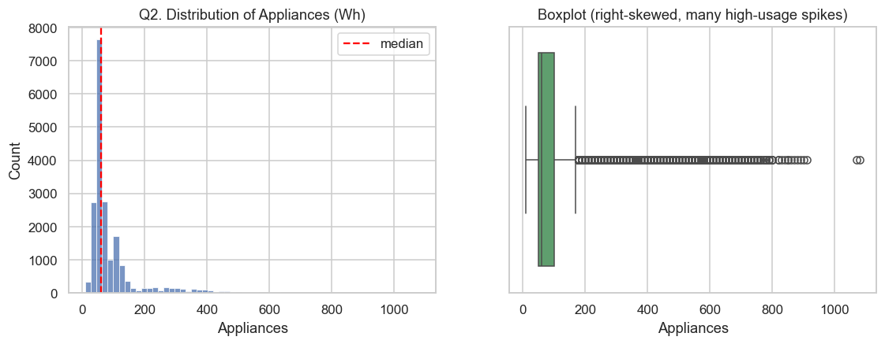
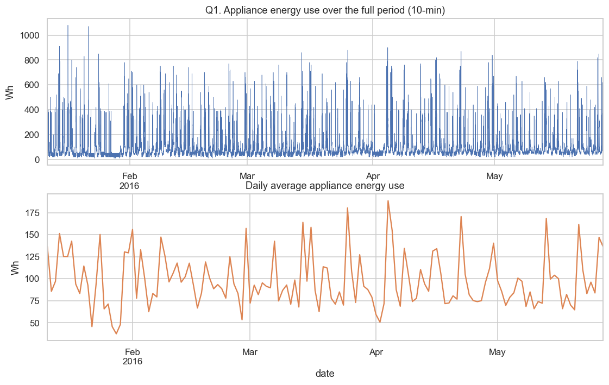
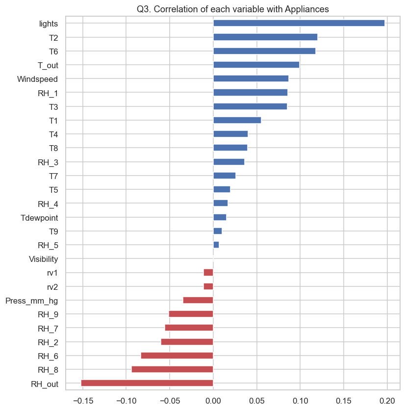
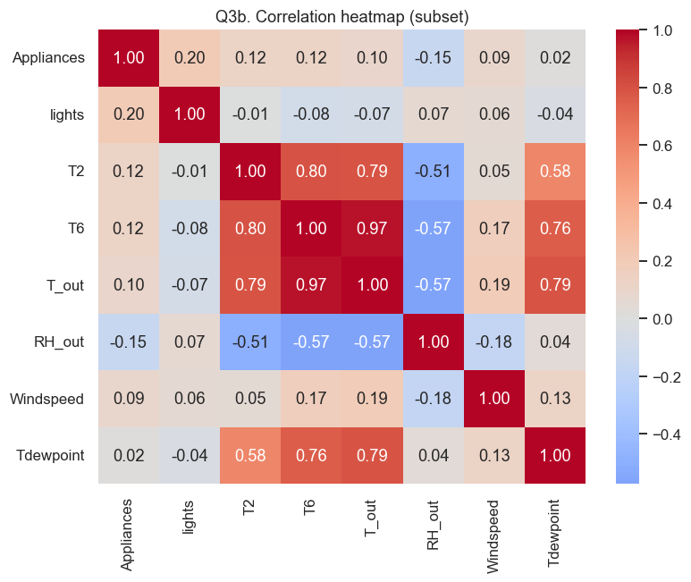
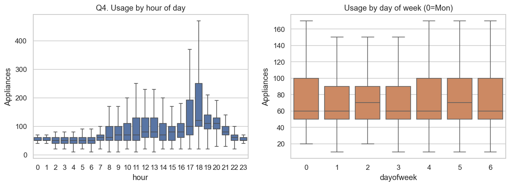
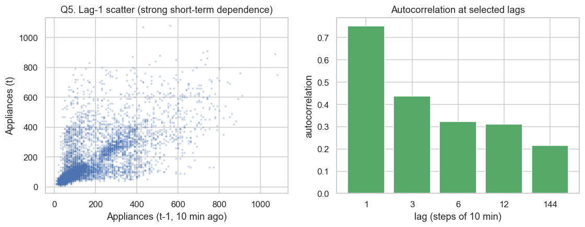
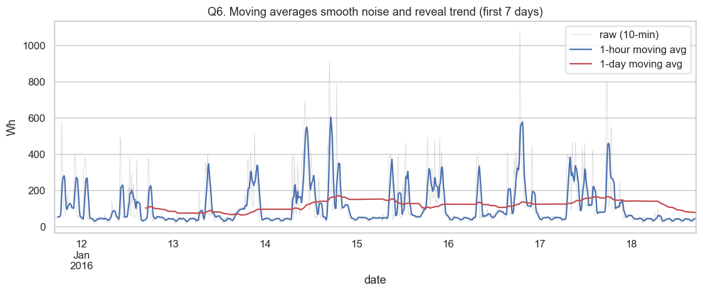
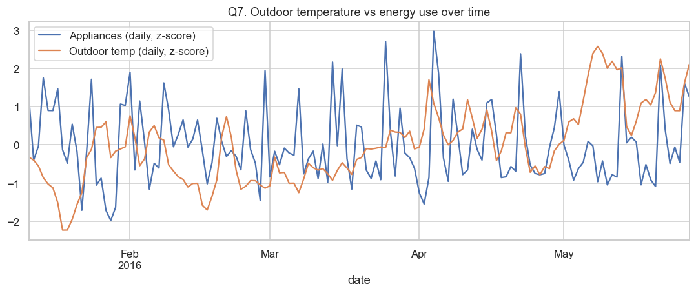
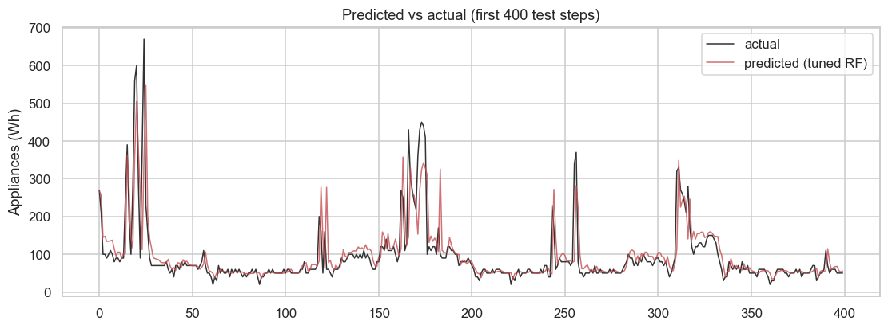
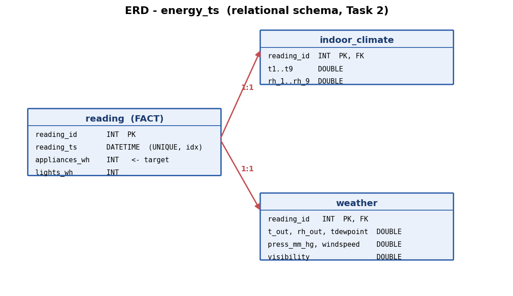

# Building a Pipeline for Time-Series Data
### Formative 1 — Group Report

**Team (3):** Jeremie Iyamurinze · Celine Shoga · Gentil Tonny Christian Iradukunda
**Dataset:** UCI *Appliances Energy Prediction* · **Repo:** https://github.com/Iyamurinze/Pipeline-for-Time-Series-Data

---

## 1. Problem Definition & Dataset Justification

**Problem.** We forecast short-term **household appliance energy consumption (Wh)** from
recent usage history and environmental sensor readings. Accurate short-horizon forecasts
support demand awareness, load shifting, and anomaly detection in smart-home / smart-grid
settings — a genuinely useful, domain-relevant task.

**Why this dataset.** The UCI *Appliances Energy Prediction* dataset fits every requirement:

- **Clear timestamp** — a `date` column sampled at a regular **10-minute** cadence.
- **Meaningful target** — `Appliances` (energy use in Wh), suitable for forecasting.
- **Multiple measurable variables over time** — 9 indoor temperature sensors, 9 indoor
  humidity sensors, and 6 outdoor weather variables (temperature, pressure, humidity,
  wind speed, visibility, dew point).

At **19,735 rows × 28 columns over 137 days**, it is large enough for meaningful lag /
moving-average feature engineering yet small enough to process on a laptop.

---

## 2. Task 1 — Preprocessing, EDA & Modeling
*(Owner: Jeremie Iyamurinze — see `task1_eda_modeling/Task1_EDA_and_Modeling.ipynb`)*

### 2.1 Understanding the dataset
| Property | Value |
|---|---|
| Rows × columns | 19,735 × 28 |
| Time range | 2016-01-11 17:00 → 2016-05-27 18:00 (137 days) |
| Frequency / granularity | 10 minutes (regular) → 6 steps = 1 h, 144 steps = 1 day |
| Missing values | **0** (dataset complete) |
| Target | `Appliances` — appliance energy use (Wh) |

**Missing-value strategy.** The raw data has no gaps, but the preprocessing pipeline still
sorts by timestamp and is built to **interpolate on time** rather than drop rows — deleting
rows would break the even 10-minute spacing that lag/rolling features depend on. The
documented random-noise columns `rv1`/`rv2` are dropped.

**Distribution.** The target is strongly **right-skewed (skew ≈ 3.4)**: median 60 Wh,
mean 98 Wh, max 1080 Wh — most readings are low with occasional high-usage spikes.



### 2.2 Analytical questions (7, incl. lag features & moving averages)

**Q1 — Is there a trend or seasonality?** No strong long-term trend; the series is dominated
by **repeating daily cycles**. Short-horizon dynamics matter more than any time trend.



**Q2 — Target distribution?** Heavy right skew (above) — we therefore report both MAE and RMSE.

**Q3 — Which variables correlate with usage?** Correlations are modest: `lights` (r≈0.20),
`RH_out` (≈0.15), indoor temps `T2`/`T6` (≈0.12). No single sensor dominates, and indoor
temperatures are strongly collinear — motivating a **non-linear** model plus lag features.




**Q4 — Daily / weekly patterns?** Clear daily seasonality: lowest overnight, **peak ≈ 18:00**
(evening), with weekends flatter/higher. Justifies calendar features (hour, day-of-week, weekend).



**Q5 — Lag effect *(LAG FEATURES)*.** Usage is **highly autocorrelated**: lag-1 ≈ **0.75**,
decaying to ≈0.32 at 1 h and still ≈0.22 at 1 day (the daily echo). Past target values are the
strongest predictors → we engineer lags at 10/20/30 min, 1 h, 1 day.



**Q6 — Moving averages *(MOVING AVERAGES)*.** The 1-hour moving average removes 10-minute
noise while preserving daily shape; the 1-day moving average exposes the slow level. Both
(mean & std) become features.



**Q7 — Do weather variables track usage?** Loosely — outdoor temperature r≈0.10, humidity
≈0.15. Complementary signal, so weather columns are kept.



### 2.3 Feature engineering
Implemented in `preprocessing.build_features` (reused by Task 4):
calendar features · **lag features** (1,2,3,6,144) · **moving averages / std** (1 h, 1 day,
shifted 1 step to avoid leakage) · all indoor/outdoor sensors at time *t*. Framed as
**one-step-ahead forecasting** with a **chronological 80/20 split** (no shuffling).

### 2.4 Modeling & experiments (with hyperparameter tuning)

| Experiment | RMSE | MAE | R² | Notes |
|---|---:|---:|---:|---|
| 1. Linear Regression (baseline) | 59.09 | 27.41 | 0.547 | scaled features |
| 2. Random Forest (default) | 110.41 | 78.08 | −0.581 | **overfits** the noisy target |
| 3. **Random Forest (tuned)** | **58.14** | **26.30** | **0.562** | GridSearchCV + TimeSeriesSplit |

**Tuning.** `GridSearchCV` over `n_estimators`, `max_depth`, `min_samples_leaf`, validated
with `TimeSeriesSplit`. Best: `max_depth=12, min_samples_leaf=50, n_estimators=300`.

**Interpretation.** The default forest overfits badly (near-perfect on train, **negative test
R²**). Regularising via tuning turns it into the **best model**, narrowly beating the linear
baseline while capturing non-linear effects. Lag-1 and rolling-mean features dominate
importance — consistent with the EDA. The tuned model is saved to `models/model.pkl`.



---

## 3. Task 2 — Databases (SQL + MongoDB)
*(Owner: Celine Shoga — see `task2_databases/`)*

### 3.1 Relational schema (MySQL, 3 tables)
Normalised around the observation timestamp: `reading` is the central **fact** table (target),
extended 1:1 by `indoor_climate` (18 sensor columns) and `weather` (6 columns), linked by
`reading_id`. `reading_ts` is unique and indexed for fast latest/date-range queries.



```sql
CREATE TABLE reading (
    reading_id    INT AUTO_INCREMENT PRIMARY KEY,
    reading_ts    DATETIME NOT NULL,
    appliances_wh INT NOT NULL,          -- target
    lights_wh     INT NOT NULL,
    UNIQUE KEY uq_reading_ts (reading_ts), INDEX idx_reading_ts (reading_ts)
);
-- indoor_climate(reading_id PK/FK, t1..t9, rh_1..rh_9)
-- weather(reading_id PK/FK, t_out, press_mm_hg, rh_out, windspeed, visibility, tdewpoint)
```
Full script: `task2_databases/sql/schema.sql`.

### 3.2 SQL queries & results
Four queries (incl. latest-record and date-range time-series requirements) — full results in
`task2_databases/outputs/sql_results.md`:

<!-- SQL_RESULTS -->

### 3.3 MongoDB design
One `readings` collection, one document per timestamp, with nested `indoor` and `weather`
sub-documents and an index on `timestamp` — a single query returns a whole observation with
no joins. Sample document:

```json
{
  "reading_id": 1, "timestamp": "2016-01-11T17:00:00",
  "appliances_wh": 60, "lights_wh": 30,
  "indoor":  { "T1": 19.89, "RH_1": 47.6, "...": "T2..RH_9" },
  "weather": { "t_out": 6.6, "press_mm_hg": 733.5, "rh_out": 92.0,
               "windspeed": 7.0, "visibility": 63.0, "tdewpoint": 5.3 }
}
```

### 3.4 MongoDB queries & results
Four queries (latest, date range, hourly `$group` aggregation, high-usage) — full results in
`task2_databases/outputs/mongo_results.md`. Example — **average usage by hour** confirms the
evening peak seen in the EDA:

| hour | avg_wh | | hour | avg_wh |
|---:|---:|---|---:|---:|
| 00 | 52.8 | | 12 | ~110 |
| 06 | 57.7 | | **18** | **peak** |
| 07 | 78.6 | | 23 | ~90 |

---

## 4. Task 3 — API (CRUD + Time-Series Endpoints)
*(Owner: Gentil Tonny Christian Iradukunda — see `task3_api/`)*

A **FastAPI** service exposing symmetric endpoints over **both** databases:

| Method | SQL | Mongo | Purpose |
|---|---|---|---|
| POST/GET/PUT/DELETE | `/sql/readings…` | `/mongo/readings…` | Full CRUD |
| GET | `/sql/readings/latest` | `/mongo/readings/latest` | **Latest record** |
| GET | `/sql/readings/range` | `/mongo/readings/range` | **Records by date range** |

Interactive docs at `/docs`. A smoke test (`test_api.py`) runs a full CRUD cycle plus the
time-series endpoints against both databases and reports PASS/FAIL for each check.

<!-- API_RESULTS -->

---

## 5. Task 4 — Prediction / Forecast Script
*(Owner: Jeremie Iyamurinze — see `task4_prediction/predict.py`)*

The script consolidates the pipeline end-to-end:
**(1) fetch** a recent window from the API → **(2) preprocess** with the *same*
`build_features` pipeline as Task 1 → **(3) load** `model.pkl` → **(4) predict** the latest
record's usage.

```
[1/4] Fetching 300 recent records from .../mongo/readings/window?n=300
[2/4] Preprocessing (lag + moving-average + calendar features)...
[3/4] Loading trained model from .../models/model.pkl
[4/4] Forecast for the latest record
  timestamp        : 2016-05-27 18:00:00
  PREDICTED usage  :   264.5 Wh
  actual usage     :   430.0 Wh  (a high-usage spike)
  mean abs. error over the 156-step window :   49.0 Wh
  model test RMSE (Task 1)                    : 58.14 Wh
```
The window-level MAE (~49 Wh) matches the model's Task 1 test error, confirming the trained
model generalises through the full API→preprocess→predict path.

---

## 6. Team Contributions

| Member | Role | Major components | Tasks |
|---|---|---|---|
| **Jeremie Iyamurinze** (lead) | ML / integration | Time-series EDA, feature-engineering pipeline (`preprocessing.py`), model training + hyperparameter tuning, and the end-to-end prediction script | Task 1, Task 4 |
| **Celine Shoga** | Databases | MySQL 3-table schema + ERD, MongoDB collection design, data-loading scripts, and the required SQL + Mongo queries with results | Task 2 |
| **Gentil Tonny Christian Iradukunda** | Backend / API | FastAPI CRUD endpoints for both databases, the latest-record and date-range time-series endpoints, and the API smoke tests | Task 3 |

All members contributed to the shared repository, README, and this report.

---

## 7. How to Reproduce
See the repository `README.md` for full setup. In short: install `requirements.txt`, ensure
MySQL + MongoDB are running, run the Task 1 notebook (trains the model), load both databases
(Task 2), start the API (Task 3), then run the forecast script (Task 4).
