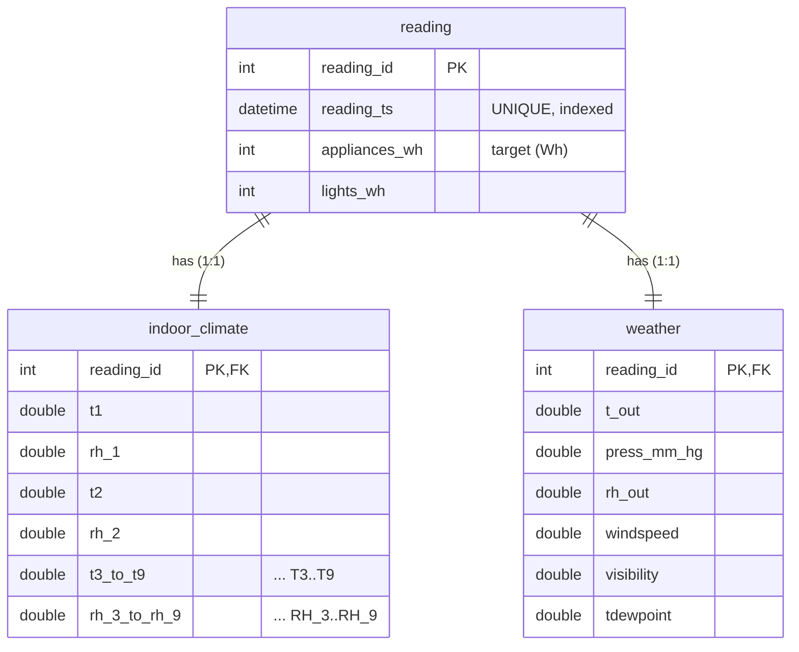

# Entity-Relationship Diagram — `energy_ts`

**Author: Celine Shoga**

The schema is normalised around the observation timestamp. `reading` is the central
fact table (holds the target, appliance energy). Each reading has exactly one indoor
sensor record and one weather record, linked by `reading_id` (1-to-1). This keeps the
fact table narrow and lets the API/queries load only the tables they need.

A rendered image version is at `erd.png` (generated by `build_erd.py`).
